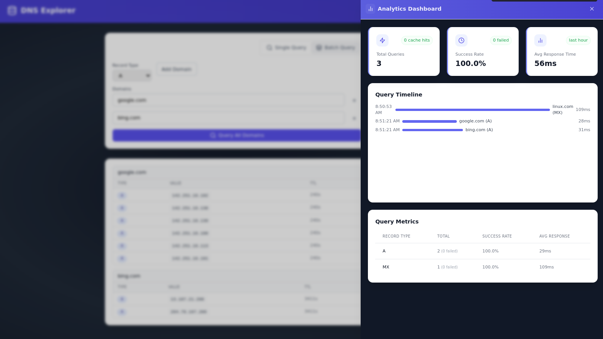

# DNS Explorer

[](https://file+.vscode-resource.vscode-cdn.net/home/ed/Desktop/2024-Projects/BOLT-PROJECTS/dns-explorer/LICENSE)    [](https://www.typescriptlang.org/)  [](https://vitejs.dev/)  [](https://tailwindcss.com/)

A modern, feature-rich DNS lookup tool built with React and TypeScript.  Explore DNS records, perform batch lookups, and analyze DNS performance with an intuitive interface.

## Features

- Single and batch DNS lookups
- Real-time analytics dashboard
- Geographic query distribution
- Reverse DNS lookup
- Dark/light theme support
- Mobile-responsive design
- Fast, cached responses
- Query history tracking




## Quick Start

```bash
# Install dependencies
npm install

# Start development server
npm run dev

# Build for production
npm run build
```

## Technology Stack

- React 18 with TypeScript
- Tailwind CSS for styling
- React Router for navigation
- Lucide React for icons
- Vite for building and development

## Project Structure

```
src/
├── components/    # React components
├── contexts/      # React contexts
├── hooks/         # Custom React hooks
├── pages/         # Page components
├── services/      # API and service logic
├── types/         # TypeScript types
└── utils/         # Utility functions
```

## Creator

Ed Bates (TECHBLIP LLC)

## Acknowledgments

Some sections of this code were generated with the assistance of AI tools.  These contributions were reviewed and integrated by the project creator(s).

## License

Apache-2.0 license - see the [LICENSE](LICENSE) file for details
